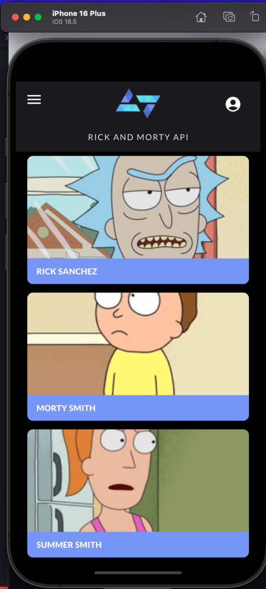
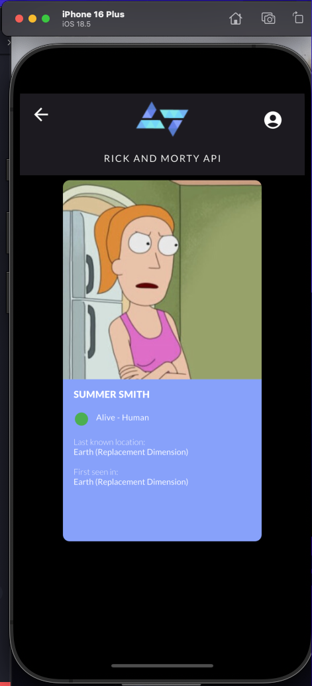
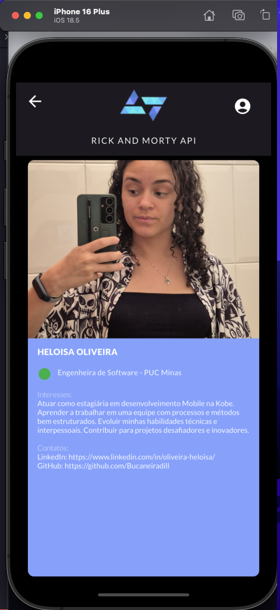

## Sobre o Projeto

Este projeto é uma aplicação desenvolvida em Flutter que permite aos usuários explorar personagens, episódios e localizações do universo Rick and Morty. O foco principal acessar uma API e desenvolver uma interface de acordo com o protótipo disponibilizado. Eu adicionei um desafio diferente àmim mesma e quis explorar uma arquitetura diferente com o gerenciamento de estados com os Riverpod, tentando seguir as melhores práticas do Flutter.

## Funcionalidades

- Listagem de personagens com paginação
- Detalhes completos dos personagens
- Informações sobre status, espécie e origem
- Detalhes de localizações
- Carregamento assíncrono com estados de loading/error

## Arquitetura

O projeto segue a arquitetura **MVVM (Model-View-ViewModel)** com as seguintes camadas:

```
lib/
├── models/           # 📦 Modelos de dados
├── services/         # 🌐 Serviços de API
├── providers/        # 🔄 ViewModels (Riverpod)
├── views/           # 🎨 Telas e Widgets
└── main.dart        # 🚀 Ponto de entrada
```

### Tecnologias Utilizadas

- **Flutter** - Framework para desenvolvimento mobile
- **Riverpod** - Gerenciamento de estado reativo
- **HTTP** - Consumo de APIs REST
- **Rick and Morty API** - Fonte de dados

### Problemas obtidos durante o desenvolvimento

- Tive problemas com a versão do ndk do Android
- Tive problemas com algumas configurações Android do projeto, por causa da versão Java instalada no meu computador (Talvez tenham problema para rodar a aplicação na própria máquina)
- Criei uma features de episódios, mas não tive tempo de ajustar o Drawer para fazer a troca entre personagens e episódios.

## Configuração do Projeto

### Pré-requisitos

- Flutter SDK (>= 3.0.0)
- Dart SDK (>= 3.0.0)
- Android Studio / VS Code
- Emulador Android ou dispositivo físico

### Instalação

1. **Clone o repositório:**

```bash
git clone https://github.com/seu-usuario/kode-start.git
cd kode-start
```

2. **Entre na pasta**

```bash
cd kode_start_new
```

4. **Instale as dependências:**

```bash
flutter pub get
```

3. **Execute o projeto:**

```bash
flutter run
```

## Dependências

```yaml
dependencies:
  cupertino_icons: ^1.0.2
  google_fonts: ^6.3.0
  dio: ^5.9.0
  flutter_riverpod: ^2.6.1
  riverpod_annotation: ^2.6.1
  flutter_native_splash: ^2.4.6

dev_dependencies:
  flutter_test:
    sdk: flutter
  flutter_lints: ^6.0.0
  riverpod_generator: ^2.6.5
  build_runner: ^2.5.4
```

## API Utilizada

Este projeto consome a [Rick and Morty API](https://rickandmortyapi.com/), uma API RESTful gratuita que fornece:

- **Characters**: Informações sobre personagens
- **Episodes**: Dados dos episódios

### Endpoints Principais

- `GET /character` - Lista todos os personagens
- `GET /character/{id}` - Detalhes de um personagem específico
- `GET /episode` - Lista todos os episódios

## Padrão MVVM com Riverpod

### Model

```dart
class Character {
  final int id;
  final String name;
  final String status;
  // ...
}
```

### ViewModel (Provider)

```dart
final characterProvider = StateNotifierProvider<CharacterViewModel, CharacterState>((ref) {
  return CharacterViewModel(ref.read(apiServiceProvider));
});
```

### View

```dart
class CharacterListView extends ConsumerWidget {
  @override
  Widget build(BuildContext context, WidgetRef ref) {
    final state = ref.watch(characterProvider);
    // UI Logic...
  }
}
```

## 📱 Screenshots

*Em desenvolvimento - Screenshots serão adicionados em breve*

Vídeo disponível em: 

<video width="320" height="240" controls>
  <source src="assets/appvideo.mov" type="video/mov">
  Seu navegador não suporta vídeos HTML5.
</video>


| Home Page                                         | Characters                                        | User Profile                                     |
| ------------------------------------------------- | ------------------------------------------------- | ------------------------------------------------- |
|  |  |  |

## 📞 Contato

- GitHub: [@Bucaneiradill](https://github.com/Bucaneiradill)
- LinkedIn: [Seu LinkedIn](https://linkedin.com/in/oliveira-heloisa)
- Email: heloisaoliveirat@gmail.com.com
- Telefone: (31) 9 9103-1784
